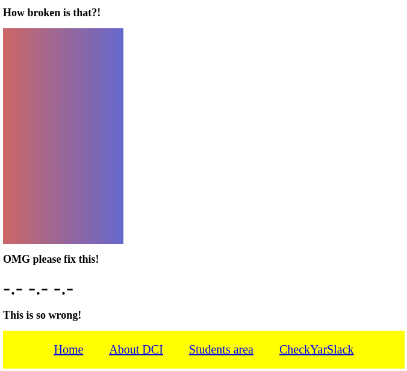

# Grundlegende CSS-Übungen

## Übung: CSS-Eigenschaft Display

**Anweisungen**:
1. Erstelle ein Stylesheet `solution.css` und verknüpfe es mit der Datei `index.html`.
2. Füge das Styling hinzu, damit die Seite dem untenstehenden Mockup ähnelt.

